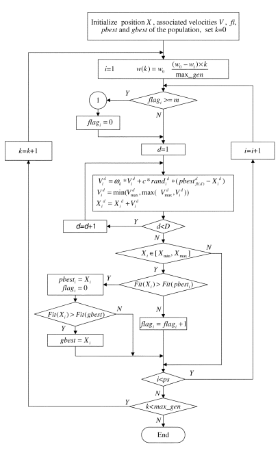

#CLPSO
=====

CLPSO uses a novel learning strategy whereby all other particles’ historical best information
is used to update a particle’s velocity. This strategy enables the
diversity of the swarm to be preserved to discourage premature
convergence. Experiments were conducted (using codes available
from http://www.ntu.edu.sg/home/epnsugan) on multimodal test
functions such as Rosenbrock, Griewank, Rastrigin, Ackley,
and Schwefel and composition functions both with and without
coordinate rotation. The results demonstrate good performance of
the CLPSO in solving multimodal problems when compared with
eight other recent variants of the PSO.

 
 
 #PSO及其相关算法比较
 
1. SaDE, self-adaptive DE，这个代码写得太长了，900多行，而且没有好的说明，没看懂，测试中的问题也是一个一个手动排除的，很不顺    利；我本来对这个寄予厚望的，没想到。

2. DE with different algorithms, 用标准的DE代码中几种算法和参数测试；        这个作者写代码的水平显然高超很多；代码写得像十四行诗，而且说明文档看起来非常舒服；测试基本没有问题；但是效果很一般；

3. ABC， artificial bee colony, 跟蚁群算法就不同了，可以说是变种的PSO，土耳其科学家2005年左右提出；本来以为新算法必然更优越，    但是，从作者提供的代码来看，使用没有太大问题；收敛的效果和速度太平淡无奇；

4. simple PSO, 尝试了不同作者提供的各种版本；针对我的问题，PSO类的综合表现总是胜其它类型算法一筹；遗传GA方法和模拟退火SA失败    之后，发现这种方法非常出色；但是，问题也很多：1)容易陷入局部极小；2)在停滞区附近的跳出和继续收敛能力弱，--任何PSO/DE都有这    样的短板--3)实际上效率比单独GA高很多，但是仍然可行性很小；

5. APSO，自动调整参数的PSO，也有尝试各种版本；老实说，这些方法的效果用在我这个问题上，跟simplePSO的差异并不显著；基本上表现相    当；尤其是，碰到stalling阶段，照样跳不出去，连GA都不如。其它传统的GA和SA就不值一提了。

6. CLPSO， 算是一种特殊一点的，表现非常出色。我估计，如果足够耐心，总能跑到全局收敛点，或者至少也是比较好的“局部收敛点”。但是    速度太慢。尤其前期收敛跟普通PSO相比甚至稍微逊色。 但是能收敛到足够好的接近全局收敛的平衡点，这个是非常非常重要的。
